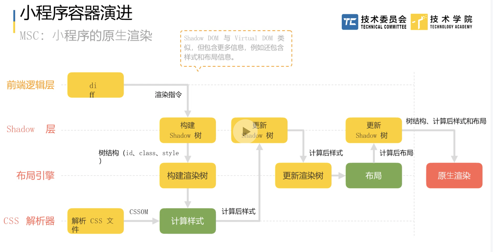

# 小程序容器运行时

## 常见的 h5 架构存在的问题

### 性能问题

网页中 js 单线程运行，长时间逻辑运行阻塞渲染

### 安全问题

网页开发中使用 dom api 改变页面。

跨站脚本攻击

跨站请求伪造

dom、bom api

泄漏用户隐私

## 小程序双层架构

页面渲染与逻辑分离

js 在纯净的 js 引擎中运行。逻辑层：请求接口、业务逻辑、数据处理等。

渲染在 webview 中。渲染层：根据模板及数据渲染页面。

渲染层和逻辑层运行在不同的线程中，即使逻辑层卡住，渲染层也可以正常渲染页面。但是并非一定的，逻辑层卡住较长或频繁时，用户的操作无法及时处理，会导致用户的操作卡顿。

## 数据驱动渲染

react
setState -> 生成 virtualdom -> diff 对比 -> 操作 dom -> 游览器渲染

小程序

setData
逻辑层 -> 生成组件树 -> diff 对比 -> 执行生命周期
渲染层 -> 数据给到模版 -> 生成 virtualdom -> diff 对比 -> 操作 dom -> 游览器渲染

## 小程序演进三种模式

上浮模式、下沉模式（直播）、同层渲染（多数业务）

## wxs

wxs 运行在渲染层。
正常一次用户操作需要经历：渲染层 -> native -> 逻辑层 -> native -> 渲染层 四次通信。wx 提供了一种较为简单的方式。可以执行动画、样式等操作 dom 的接口，无需跨层通信。逻辑简化为：渲染层 -> wxs -> 渲染层。

## 小程序的原生渲染

